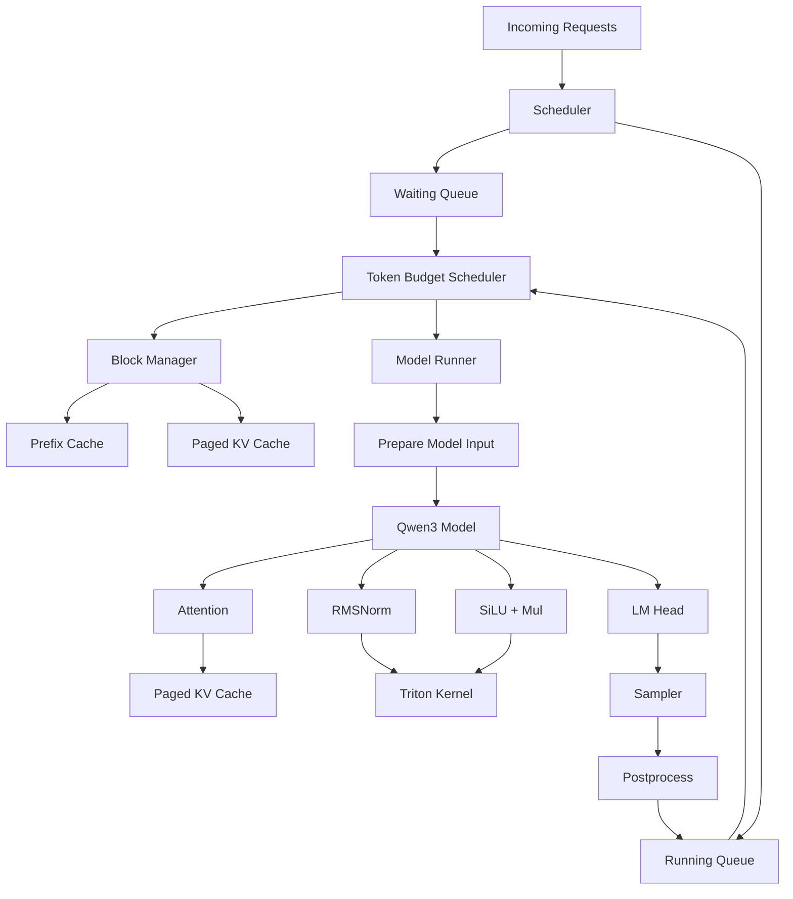

# Nano-vLLM-v1

一个用于学习和实验现代大模型推理系统机制的轻量级 LLM 推理引擎。

本项目基于 [Nano-vLLM](https://github.com/GeeeekExplorer/nano-vllm) 进行二次开发，在原有代码基础上进一步重构了 **调度器、KV Cache 管理、模型执行流程以及部分 GPU 算子**，用于学习和验证现代推理框架中的关键机制。

当前项目主要围绕以下方向进行实现与优化：

* Paged KV Cache
* Prefix Caching
* Chunked Prefill
* Token Budget 调度
* Tensor Parallelism
* CUDA Graph
* Triton 算子融合
* 在线推理 Benchmark

当前模型实现主要面向 **Qwen3**。

---

## 项目目标

该项目主要用于深入理解 LLM 推理框架内部的完整执行流程：

```text
Request
   │
   ▼
Scheduler
   │
   ▼
KV Cache Management
   │
   ▼
ModelRunner
   │
   ▼
Transformer Forward
   │
   ▼
Attention / RMSNorm / MLP
   │
   ▼
Sampling
```

相比单纯调用 Hugging Face 或 vLLM，本项目更加关注推理引擎内部机制，例如：

* 请求如何被 Scheduler 调度
* Prefill 与 Decode 如何执行
* KV Cache 如何分块管理
* Prefix Cache 如何复用
* 长 Prompt 如何被切分处理
* CUDA Graph 如何降低 Decode 阶段的 Launch Overhead
* Triton Kernel 如何减少中间 Tensor 和显存访问

---

# 主要功能

## 1. Token Budget 驱动的 Chunked Prefill

原始推理流程中，长 Prompt 的 Prefill 可能在单个 Scheduling Step 中占用大量计算资源，从而增加其他在线请求的等待时间。

本项目在 Scheduler 中加入了基于 **Token Budget** 的调度机制。

每个 Scheduling Step 设置：

```text
max_num_batched_tokens
```

作为当前 Step 可执行的最大 Token 数量。

调度过程优先处理已经处于 Running 状态的请求，并根据剩余 Token Budget 决定当前 Prefill 可以执行多少 Token。

当启用 Chunked Prefill 时：

```python
num_new_tokens = min(num_new_tokens, token_budget)
```

长 Prompt 不再要求一次完成，而是可以被拆分到多个 Scheduling Step 中执行。

例如：

```text
Prompt Length = 4096
Token Budget  = 1024

Step 1:
Prefill 0 ~ 1023

Step 2:
Prefill 1024 ~ 2047

Step 3:
Prefill 2048 ~ 3071

Step 4:
Prefill 3072 ~ 4095
```

每个 Sequence 会维护：

```text
num_cached_tokens
num_new_tokens
block_table
```

从而记录：

```text
已经进入 KV Cache 的 Token
当前 Step 需要计算的 Token
对应的 KV Cache Block
```

实现跨 Step 的增量 Prefill。

---

## 2. Running / Waiting Queue 调度

Scheduler 维护两类请求队列：

```text
waiting
running
```

### Waiting Queue

存储尚未进入推理流程的新请求。

### Running Queue

存储已经分配 KV Cache，并正在进行 Prefill 或 Decode 的请求。

当前调度策略优先处理 Running Queue：

```text
Running Request
      │
      ▼
Consume Token Budget
      │
      ▼
Remaining Token Budget
      │
      ▼
Admit Waiting Request
```

当还有剩余 Token Budget 与 KV Cache 空间时，Scheduler 再从 Waiting Queue 中加入新的请求。

---

# KV Cache 管理

## 3. Paged KV Cache

KV Cache 使用固定大小的 Block 进行管理。

每一个 Sequence 保存自己的：

```text
block_table
```

用于记录逻辑 Sequence 与物理 KV Cache Block 之间的映射关系。

整体结构类似：

```text
Sequence A
   │
   ├── Block 3
   ├── Block 8
   └── Block 12

Sequence B
   │
   ├── Block 1
   └── Block 7
```

BlockManager 负责：

* Block 分配
* Block 释放
* Block 引用计数
* KV Cache 空间检查
* Decode 阶段动态扩展
* Chunked Prefill 增量扩展

---

## 4. Prefix Caching

项目实现了基于 Token Block Hash 的 Prefix Cache。

完整 Token Block 会计算 Hash：

```text
Token Block
    │
    ▼
XXHash
    │
    ▼
hash_to_block_id
```

当新请求进入系统时，会检查其 Prompt 前缀是否已经存在于 KV Cache 中。

如果命中：

```text
Prompt
  │
  ▼
Prefix Cache Lookup
  │
  ├── Hit
  │     │
  │     └── 复用已有 KV Block
  │
  └── Miss
        │
        └── 重新计算并分配 Block
```

这样可以避免重复计算相同 Prompt Prefix。

为了兼容 Chunked Prefill，本项目只对完整 Block 建立 Prefix Cache。

未填满的 Block 不参与 Hash Cache，从而避免部分 Prefill Block 被错误加入 Prefix Cache。

---

# ModelRunner

## 5. 混合 Prefill / Decode 输入构建

ModelRunner 会根据 Scheduler 当前选出的 Sequence 动态构建模型输入。

主要包括：

```text
input_ids
positions
cu_seqlens_q
cu_seqlens_k
slot_mapping
context_lens
block_tables
```

其中：

### `slot_mapping`

用于表示当前 Token 在 KV Cache 中应该写入的位置。

### `block_tables`

记录每个 Sequence 对应的 KV Cache Block。

### `context_lens`

记录每个 Sequence 当前已经拥有的 Context 长度。

### `cu_seqlens_q / cu_seqlens_k`

用于 FlashAttention Variable Length Attention。

通过这些 Metadata，ModelRunner 可以统一处理：

```text
Normal Prefill

Prefix Cache Prefill

Chunked Prefill

Decode
```

---

# Attention

## 6. Prefill 与 Decode 使用不同 Attention Path

Attention 会根据当前请求状态选择不同的执行路径。

### Prefill / Chunked Prefill

使用：

```python
flash_attn_varlen_func
```

用于处理 Variable Length Query。

### Decode

当：

```text
max_seqlen_q <= 1
```

时，说明当前请求处于 Decode 阶段。

此时使用：

```python
flash_attn_with_kvcache
```

直接从 Paged KV Cache 中读取历史 Key / Value。

整体流程：

```text
                Attention
                    │
          ┌─────────┴─────────┐
          │                   │
       Prefill              Decode
          │                   │
          ▼                   ▼
FlashAttention Varlen   KV Cache Attention
          │                   │
          ▼                   ▼
     New KV Cache         Paged KV Cache
```

---

# Triton 算子优化

## 7. RMSNorm Triton Kernel

项目实现了自定义 RMSNorm Kernel。

计算过程：

```text
Input
  │
  ▼
Square
  │
  ▼
Reduction
  │
  ▼
mean(x²)
  │
  ▼
rsqrt(mean(x²) + eps)
  │
  ▼
Normalize
  │
  ▼
Multiply Weight
  │
  ▼
Output
```

计算过程中使用 FP32 完成 Reduction 和归一化，再写回原始数据类型。

---

## 8. Add + RMSNorm 融合

Transformer Decoder 中经常出现：

```text
Residual Add
      +
RMSNorm
```

如果分别执行，会产生额外的中间 Tensor 和显存访问。

本项目使用 Triton 将二者融合：

```text
hidden_states ──┐
                ├── Add ──► RMSNorm ──► Output
residual ───────┘
                   │
                   └────────► New Residual
```

融合后减少：

* 中间 Tensor 创建
* Kernel Launch
* Global Memory Read / Write

---

## 9. SiLU + Mul 融合

Qwen3 MLP 中使用：

```python
silu(x) * y
```

本项目将：

```text
SiLU
 +
Mul
```

融合为一个 Triton Kernel。

---

## 10. KV Cache Store Kernel

Attention 中新增生成的 K / V 需要写入 KV Cache。

本项目使用 Triton Kernel 根据：

```text
slot_mapping
```

将每个 Token 的 Key / Value 写入对应的 KV Cache Slot。

流程：

```text
New Key / Value
      │
      ▼
slot_mapping
      │
      ▼
KV Cache Physical Slot
      │
      ▼
Paged KV Cache
```

---

# CUDA Graph

## 11. Decode CUDA Graph

Decode 阶段通常存在大量小 Kernel Launch。

为了降低 Python 与 Kernel Launch Overhead，本项目支持 CUDA Graph。

ModelRunner 会提前 Capture 多种 Batch Size：

```text
1
2
4
8
16
32
...
```

运行时根据当前 Decode Batch Size 选择合适的 Graph 进行 Replay。

```text
Decode Batch
     │
     ▼
Select CUDA Graph
     │
     ▼
Graph Replay
     │
     ▼
Transformer Forward
```

当前 CUDA Graph 主要用于 **Pure Decode**。

对于：

```text
Prefill
Chunked Prefill
```

由于 Query Length 和 Attention Metadata 会动态变化，因此仍然使用普通执行路径。

可以通过：

```bash
--enforce-eager
```

关闭 CUDA Graph。

---

# Tensor Parallelism

## 12. Tensor Parallel

项目支持基于 PyTorch Distributed + NCCL 的 Tensor Parallel。

模型中包括：

```text
QKVParallelLinear

MergedColumnParallelLinear

RowParallelLinear

VocabParallelEmbedding

ParallelLMHead
```

可以通过：

```python
llm = LLM(
    model_path,
    tensor_parallel_size=2
)
```

启用多 GPU Tensor Parallel。

---

# Benchmark

项目包含多种 Benchmark，用于测试不同层级的推理性能。

---

## 13. 单算子 Benchmark

`bench_ops.py` 用于比较：

```text
PyTorch Eager

torch.compile

Triton
```

目前测试：

```text
RMSNorm

Add + RMSNorm

Q/K RMSNorm

SiLU + Mul
```

运行：

```bash
python bench_ops.py \
    --model ~/models/Qwen3-4B \
    --mode loop
```

---

### Loop Mode

```bash
--mode loop
```

使用：

```python
triton.testing.do_bench
```

Benchmark 会刷新 L2 Cache，更适合观察真实 HBM Memory Traffic。

---

### CUDA Graph Mode

```bash
--mode graph
```

使用 CUDA Graph Replay，减少 Kernel Launch Overhead。

更加适合观察 Kernel 本身的执行性能。

---

### Bandwidth Benchmark

Benchmark 中还会测试 GPU Copy Bandwidth：

```text
GPU Memory Copy
      │
      ▼
Measured Bandwidth
      │
      ▼
Effective Bandwidth
      │
      ▼
Bandwidth Utilization
```

用于估计算子的有效显存带宽利用率。

---

# Decode Benchmark

## 14. Decode-only Benchmark

普通 End-to-End Benchmark 中，Prefill 和排队时间可能掩盖算子优化带来的性能变化。

因此项目提供：

```text
decode_bench.py
```

专门测试 Steady-state Decode。

例如：

```bash
python decode_bench.py \
    --model ~/models/Qwen3-4B \
    --batch-size 64 \
    --input-len 1 \
    --output-len 256
```

启用 Triton：

```bash
python decode_bench.py \
    --model ~/models/Qwen3-4B \
    --batch-size 64 \
    --input-len 1 \
    --output-len 256 \
    --use-triton
```

统计指标包括：

```text
Prefill Latency

Median Decode Step Latency

Mean Decode Step Latency

P90 Decode Step Latency

TPOT

Decode Throughput
```

---

# Online Serving Benchmark

## 15. 在线推理 Benchmark

`serving_bench.py` 用于模拟在线推理请求。

请求到达时间基于指数分布生成，用于近似：

```text
Poisson Request Arrival
```

运行：

```bash
python serving_bench.py \
    --model /path/to/Qwen3-4B \
    --request-rate 8 \
    --num-requests 256 \
    --tensor-parallel-size 1 \
    --max-num-batched-tokens 2048 \
    --max-num-seqs 512 \
    --random-input-len 128 \
    --random-output-len 128 \
    --chunked-prefill
```

Benchmark 会统计：

```text
Throughput

Average TTFT

Average TPOT

Average Latency
```

其中：

### TTFT

Time To First Token

表示：

```text
Request Arrival
      │
      ▼
First Token Generated
```

所需要的时间。

### TPOT

Time Per Output Token

用于反映 Decode 阶段 Token 生成速度。

---

# Hidden-size RMSNorm End-to-End Benchmark

项目还提供：

```text
serving_bench_hidden_rms.py
```

用于单独观察 Transformer Hidden Size 上：

```text
RMSNorm

Add + RMSNorm
```

使用 Triton 后，对端到端 Serving 性能的影响。

运行：

```bash
python serving_bench_hidden_rms.py \
    --model ~/models/Qwen3-4B \
    --num-requests 256 \
    --request-rate 8 \
    --random-input-len 128 \
    --random-output-len 128
```

脚本会自动比较：

```text
Baseline
PyTorch / torch.compile

vs

Triton
RMSNorm + Add-RMSNorm
```

并输出：

```text
Total Time

Throughput

Average TTFT

Average TPOT

Average Latency
```

---

# 项目架构



---

# 项目目录

```text
nano-vllm-v1/
│
├── nanovllm/
│
│   ├── engine/
│   │
│   │   ├── scheduler.py
│   │   ├── model_runner.py
│   │   ├── block_manager.py
│   │   ├── sequence.py
│   │   └── llm_engine.py
│
│   ├── layers/
│   │
│   │   ├── attention.py
│   │   ├── layernorm.py
│   │   ├── triton_ops.py
│   │   ├── activation.py
│   │   ├── linear.py
│   │   ├── rotary_embedding.py
│   │   └── sampler.py
│
│   ├── models/
│   │
│   │   └── qwen3.py
│
│   └── config.py
│
├── example.py
├── bench.py
├── bench_ops.py
├── decode_bench.py
├── serving_bench.py
├── serving_bench_hidden_rms.py
└── pyproject.toml
```

---

# 安装

## 环境要求

当前项目主要依赖：

```text
Python >= 3.10

PyTorch >= 2.4

Triton >= 3.0

Transformers >= 4.51

FlashAttention

NVIDIA CUDA GPU
```

Clone：

```bash
git clone https://github.com/weistbrook/nano-vllm-v1.git

cd nano-vllm-v1
```

安装：

```bash
pip install -e .
```

FlashAttention 需要根据当前：

```text
CUDA Version

PyTorch Version

GPU Architecture
```

选择对应版本。

---

# Quick Start

当前项目主要用于运行本地 Qwen3 权重。

例如：

```python
from nanovllm import LLM, SamplingParams


model_path = "/path/to/Qwen3-4B"

llm = LLM(
    model_path,
    enforce_eager=False,
    tensor_parallel_size=1,
    chunked_prefill=True,
)

sampling_params = SamplingParams(
    temperature=0.6,
    max_tokens=256,
)

prompts = [
    "介绍一下 KV Cache。",
    "什么是 Chunked Prefill？",
]

outputs = llm.generate(
    prompts,
    sampling_params,
)

for output in outputs:
    print(output["text"])
```

---

# 主要配置参数

主要推理配置位于：

```text
nanovllm/config.py
```

| 参数                          | 说明                                            |
| --------------------------- | --------------------------------------------- |
| `max_num_batched_tokens`    | 每个 Scheduling Step 最大 Token Budget            |
| `max_num_seqs`              | 最大并发 Sequence 数                               |
| `max_model_len`             | 最大 Sequence Length                            |
| `gpu_memory_utilization`    | KV Cache 可使用的 GPU Memory 比例                   |
| `tensor_parallel_size`      | Tensor Parallel GPU 数量                        |
| `kvcache_block_size`        | KV Cache Block Size                           |
| `chunked_prefill`           | 是否启用 Chunked Prefill                          |
| `enforce_eager`             | 是否关闭 CUDA Graph                               |
| `use_triton`                | 是否启用部分 Triton 算子                              |
| `use_triton_hidden_rmsnorm` | 是否启用 Hidden-size Triton RMSNorm / Add-RMSNorm |

---

# 当前项目定位

本项目目前主要用于：

```text
LLM Inference 学习

Scheduler 机制实验

KV Cache 管理实验

Chunked Prefill 实现

Triton Kernel 优化

推理性能 Benchmark
```

其目标并不是直接替代生产环境中的 vLLM，而是通过一个较小的代码库理解现代 LLM 推理框架的核心机制。

当前主要限制包括：

* 模型实现目前主要针对 Qwen3
* 模型需要使用本地权重路径
* 暂未实现 OpenAI-compatible HTTP Server
* 功能覆盖范围小于完整 vLLM
* Kernel 与 Scheduler 仍以学习和实验为主要目标
* 不同 GPU、Batch Size、Prompt Length 下性能差异较大

---

# 后续计划

后续主要计划围绕以下方向继续优化：

```text
                     LLM Inference
                           │
             ┌─────────────┴─────────────┐
             │                           │
        System Level                Kernel Level
             │                           │
        Scheduler                     Triton
        KV Cache                 Operator Fusion
        Chunked Prefill          Memory Access
        Prefix Cache             Kernel Launch
        CUDA Graph               Bandwidth
```

后续可能继续尝试：

* 更复杂的调度策略
* 更完整的 Chunked Prefill Benchmark
* P95 / P99 TTFT 与 TPOT 统计
* 更多 Triton Fused Kernel
* 更细粒度 GPU Profiling
* 不同 Prompt Length 下的调度性能分析
* 更多模型架构支持

---

# Acknowledgements

本项目基于：

[Nano-vLLM](https://github.com/GeeeekExplorer/nano-vllm)

进行学习和二次开发。

部分设计参考：

[vLLM](https://github.com/vllm-project/vllm)

主要用于学习现代 LLM 推理系统中的：

```text
Scheduling

KV Cache

Paged Attention

Prefix Caching

Chunked Prefill

CUDA Graph

Tensor Parallel

Triton Kernel
```

等核心机制。

---

# License

MIT License
